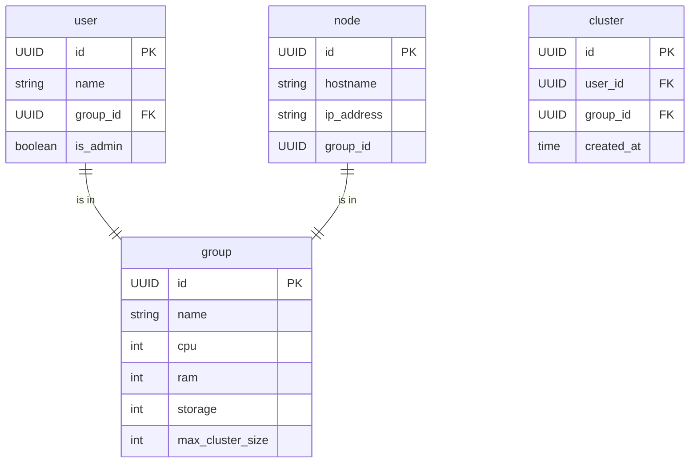

# Informatics Virtual-Cluster backend

## Database Specs

```mermaid
erDiagram
    user {
        UUID id PK
        string name
        UUID group_id FK
        boolean is_admin
    }
    
    group {
        UUID id PK
        string name
        int cpu
        int ram
        int storage
        int max_cluster_size
    }
    
    node {
        UUID id PK
        string hostname
        string ip_address
        UUID group_id
    }
    
    cluster {
        UUID id PK
        UUID user_id FK
        UUID group_id FK
        time created_at
    }

    user ||--|| group : "is in"
    node ||--|| group : "is in"
```
